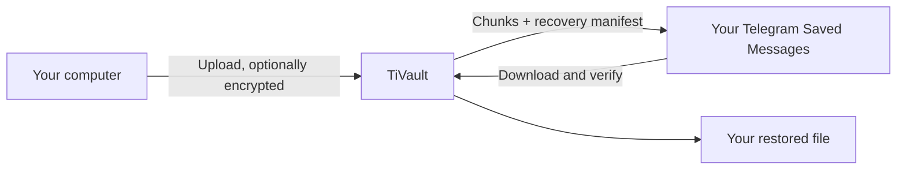

<p align="center">
  
</p>

<p align="center">
  A private desktop vault that stores your files in your own Telegram Saved Messages.
</p>

## What is TiVault?

TiVault is a free, open-source app for Windows, macOS, and Linux. It uploads files to your own Telegram account, keeps a local catalogue of them, and can optionally encrypt files before upload.

| You get | What it means |
| --- | --- |
| Your Telegram account | Files are sent to your Saved Messages, not a TiVault server. |
| Large-file support | Files are streamed in 1 GB chunks and rebuilt automatically. |
| Optional encryption | Files can be encrypted locally before they leave your computer. |
| Cross-platform app | Native desktop builds for macOS, Windows, and Linux. |



## Start here

1. Download TiVault from [Releases](../../releases).
2. Open **Accounts → Connect account**.
3. Create a Telegram application at [my.telegram.org](https://my.telegram.org/) and enter its API ID and API hash.
4. Upload a file or folder. TiVault handles chunking, progress, and verification.
5. Export and store your recovery key somewhere safe.

> TiVault is alpha software. Start with non-critical files and test recovery before relying on it.

## Main features

| Area | Included |
| --- | --- |
| Files and folders | Drag and drop, folder upload/download, create folders, rename, move, copy, favorites, tags, sorting, and duplicate detection. |
| Transfers | Upload/download queue, pause, resume, retries, FLOOD_WAIT handling, speed/progress reporting, and notifications. |
| Viewing | Local previews and thumbnails for images, videos, audio, PDFs, text, and supported documents. |
| Privacy | Optional XChaCha20-Poly1305 encryption, recovery key, OS Keychain storage, app lock, and local-only preview cache. |
| Recovery | Telegram manifest scan, recovery test wizard, vault health checks, and Recycle Bin. |
| Sharing | Send a readable file or folder copy to a confirmed Telegram user or chat. |

## Security and recovery

| Item | Where it lives |
| --- | --- |
| Telegram files | Your Telegram Saved Messages |
| Telegram API hash and recovery key | macOS Keychain, Windows Credential Manager, or Linux Secret Service |
| Catalogue, session, and transfer history | Private local application data |
| Preview cache | Local disk; clear it anytime in Settings |

- Encryption is optional. When enabled, TiVault encrypts the file locally before uploading it.
- The recovery key is essential for encrypted files. Keep an offline backup.
- Deleting a file first moves it to the Recycle Bin. Telegram chunks are deleted only after permanent deletion or the selected retention period.
- Sharing an encrypted vault file creates a separately readable Telegram copy after confirmation. It never shares the recovery key.

Never post your API hash, login code, two-step password, Telegram session, or recovery key in an issue.

## Important limits

TiVault does not impose an application-level maximum file size, but it cannot bypass Telegram limits, network speed, disk space, account limits, or rate limits. Large files are streamed in 1 GB chunks to keep temporary disk use bounded. Telegram may slow a transfer or return `FLOOD_WAIT`; TiVault waits and retries rather than bypassing those controls.

TiVault is not affiliated with Telegram. Use it in accordance with Telegram's terms and local law.

## Install notes

| Platform | Install |
| --- | --- |
| macOS | Drag **TiVault** to Applications. Because alpha builds are not Apple-notarized, Control-click → **Open** on first launch if needed. |
| Windows | Run the NSIS installer. Verify the release checksum before choosing **More info → Run anyway** in SmartScreen. |
| Linux | Use the `.deb`, `.rpm`, or AppImage package. For AppImage: `chmod +x TiVault*.AppImage`. |

Installers are signed for TiVault's updater and include published SHA-256 checksums, but they are not commercially code-signed or Apple-notarized.

## Build from source

Requirements: Node.js 20+, Rust stable, and the platform dependencies listed in the [Tauri prerequisites](https://v2.tauri.app/start/prerequisites/).

```bash
npm install
npm run desktop:dev
```

```bash
# Verify
npm run build
npm test
cargo test --manifest-path src-tauri/Cargo.toml

# Build a desktop bundle
npm run desktop:build
```

## Project guide

| Need | Read |
| --- | --- |
| Security model | [docs/SECURITY.md](docs/SECURITY.md) |
| How the app works | [docs/ARCHITECTURE.md](docs/ARCHITECTURE.md) |
| Signed updates | [docs/UPDATES.md](docs/UPDATES.md) |
| License | [MIT License](LICENSE) |

## License

MIT © 2026 TiVault contributors.
